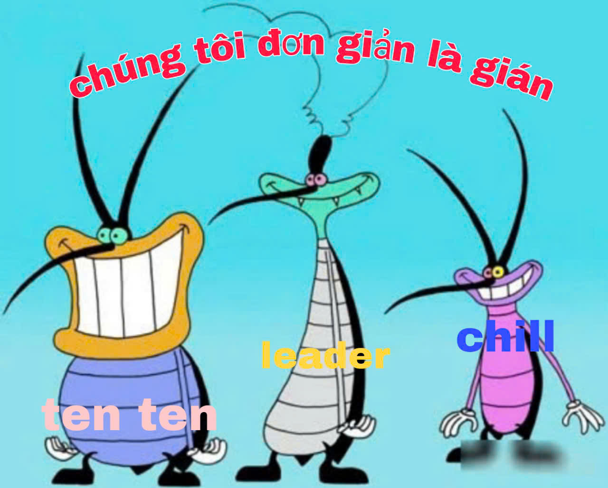
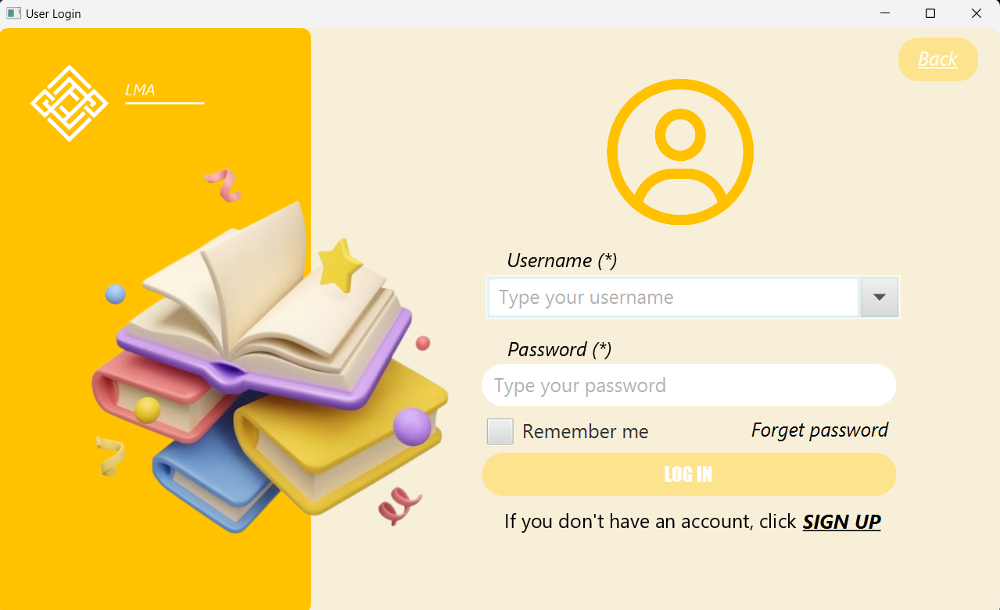
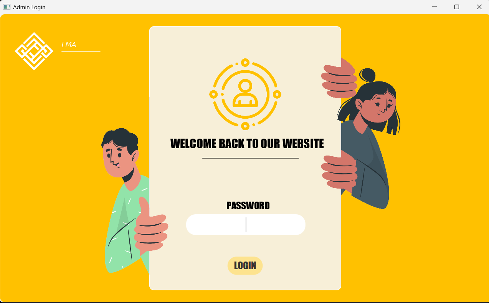
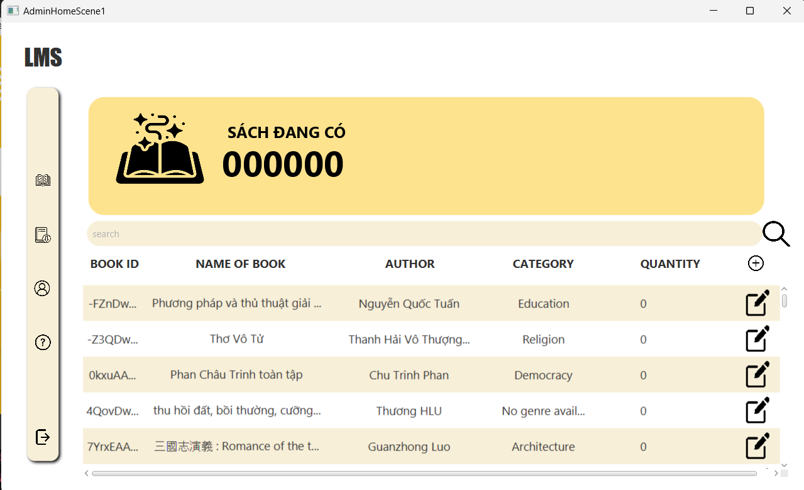
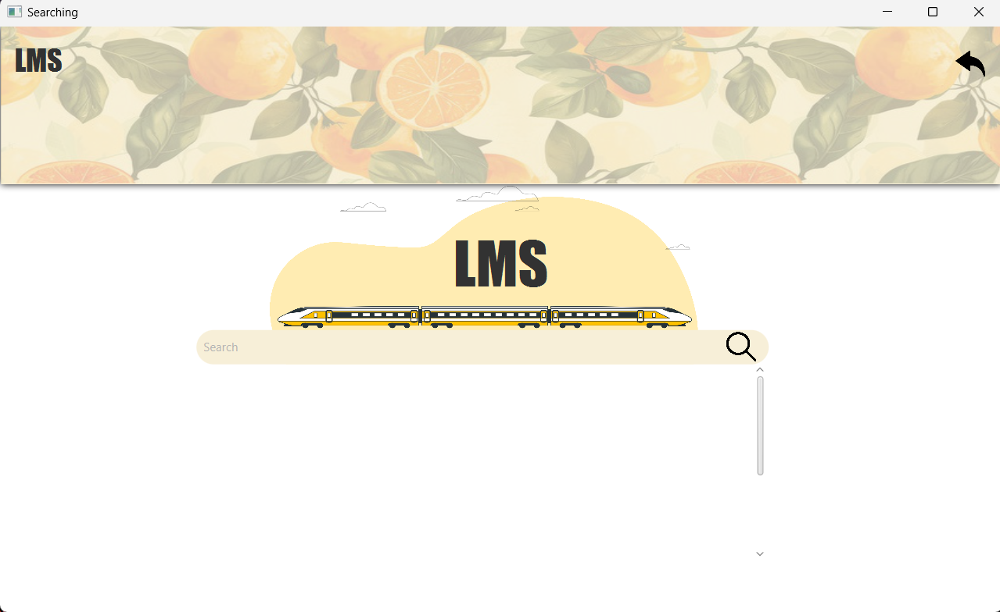
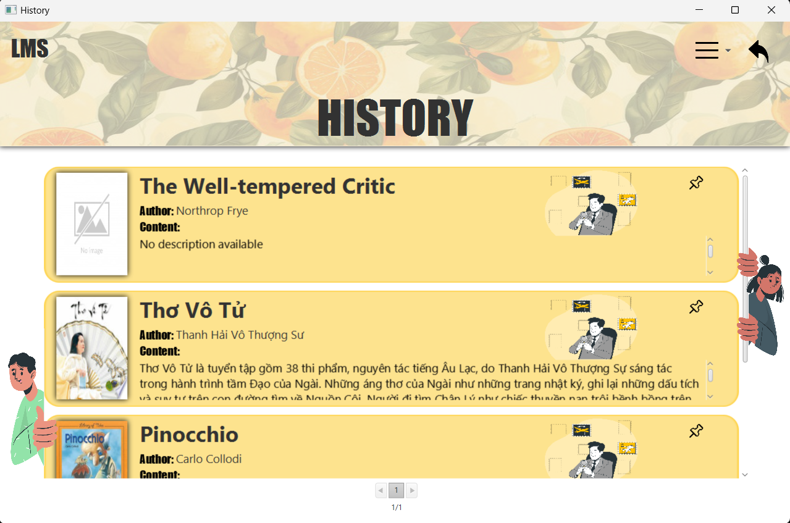
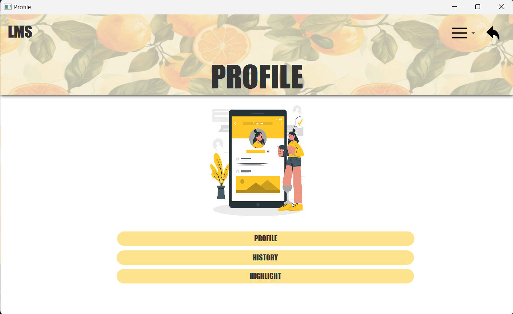

# Library-Management-System-web

Group: 3 chú gián siêu siêu dễ thương
Project: Library Management System

Các thành viên:

1. Phạm Mai Anh - 23021469 - JOEY
2. Nguyễn Thị Ngọc Yến - 23021757 – MARKY - leader
3. Nguyễn Thị Thanh Tuyền - 23021717 - DEE DEE

Xin chào, chúng tôi là nhóm 3 chú gián đáng yêu!
Chúng tôi rất vui mừng khi được giới thiệu dự án này đến mọi người! Đây là một ứng dụng hiện đại và tiện dụng, hơn nữa giao diện còn siêu siêu đẹp, lấy màu vàng làm màu chủ đạo, trông bắt mắt, thân thiện.
3 chú gián chúng tôi đã tận dụng hết kĩ năng mặc dù tính năng chưa được đa dạng phong phú, 3 chú gián sẽ luyện công để tiếp tục cải thiện chức năng, hy vọng rằng sec đáp ứng được nhu cầu của người dùng.
Hãy cùng xem qua demo giao diện nào.
Đây là giao diện khi vao cua chúng tôi:

Giới thiệu về ứng dụng
Hỗ trợ 3 chú gián trong việc tạo ra dự án thì không thể thiếu:
Backend: Java
Frontend: JavaFX
Cơ sở dữ liệu: MySQL

Vậy còn các chức năng thì thế nào…
Các chức năng chính:
Giao diện đăng nhập user và admin

Chọn chế độ truy cập:
Nếu bạn là admin, hãy chọn truy cập dành cho admin.
Nếu bạn là user, chọn chế độ dành cho user.
Đăng nhập/Đăng ký:
Đăng nhập: Dành cho người đã có tài khoản.
Đăng ký: Tạo tài khoản mới để sử dụng.

Tính năng dành cho admin:
Quản lý thông tin người dùng (hồ sơ, danh sách sách đã mượn).
Xử lý các báo cáo từ người dùng.
Thêm, sửa, xóa và tìm kiếm thông tin về người dùng và sách.

Tính năng dành cho user:
Duyệt sách, mượn sách hoặc lưu sách vào danh sách yêu thích.
Xem lại danh sách sách đã mượn hoặc đã lưu.
Chỉnh sửa thông tin cá nhân trong phần hồ sơ.
Tìm kiếm sách nhanh chóng.
Báo cáo vấn đề gặp phải.
Giải trí với trò chơi và nghe nhạc tích hợp.

Một phần tính năng của user:

Đăng xuất:
Nhấn nút đăng xuất ở góc trái màn hình để thoát tài khoản.

Hướng phát triển tương lai
Chúng tôi dự định bổ sung thêm các tính năng mới, tối ưu hóa hiệu suất, và nâng cao trải nghiệm người dùng.
Đóng góp ý kiến
Chúng tôi rất mong nhận được những phản hồi và ý kiến đóng góp từ các bạn để hoàn thiện ứng dụng này. Mọi sự góp ý đều rất quý giá và là động lực để chúng tôi phát triển dự án tốt hơn!
3 chú gián rất mong nhận được các ý kiến đóng góp từ các bạn!

Mặc dù dự án của chúng tôi còn nhiều thiếu sót, chúng tôi vẫn hi vọng có thể mang đến cho các bạn những trải nghiệm tốt nhất!!!
Lần cuối cùng 3 con gián xin gửi tình cảm đến với các bạn đã đọc đến đây!
Cockraches with love

(3 con gián đã quay video, hi vọng các bạn xem video để không hụ lòng của gián!!!)

Bonus:
Chúng tôi vẫn còn vị trí Oggy và Jack (not J97), nếu các bạn có nhu cầu hãy liên hệ tới 3 con gián để được ứng tuyển ngay nào. Còn gì bằng khi được làm việc với 3 chú gián dễ thương như này chứ hả????
